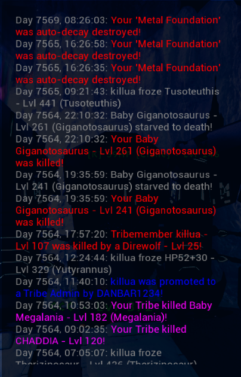
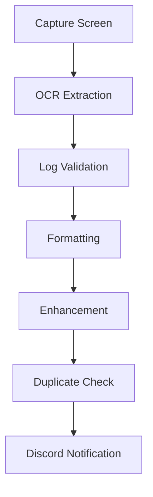

# 🧠 AscendedTribeWatcher

Real-time screen watcher for **ARK: Survival Ascended**, designed to capture, process, and notify you about in-game log events via Discord. Built for Linux users with OCR and image-based detection.

---

## 🔍 Overview

The tool monitors your screen in real-time, extracts log messages using OCR, filters and enhances them, then notifies a Discord channel. Ideal for tribe surveillance, raids, and activity tracking in **dark places** with specific gamma settings.

---

## 📸 Screenshots

  
*In-game log capture preview*

  
*Formatted Discord notification sample*

---

## 📊 Pipeline


---
## ⚙️ Requirements

-   Linux OS

-   ARK: Survival Ascended (DX11 mode)

-   Gamma set to 1

-   Must be in dark places (no replicators or bright lighting)

-   Tesseract OCR installed

-    Discord Webhook configured
---
## 📦 Build & Run
```bash
git clone https://github.com/Daniils12334/AscendedTribeWatcher.git
cd AscendedTribeWatcher
mkdir build && cd build
cmake ..
make
./gamma_logger_advanced
```
```bash
    For Python OCR preprocessing (if any):

source .venv/bin/activate
python3 your_ocr_script.py
```
---
## 🧾 Rules for Best Accuracy

-    Use Gamma 1

-    Avoid replicators or bright objects

-    Play in dark environments

-    Use DX11 renderer on Linux (Proton or native)

-    Enable detailed logs in ARK settings

## 💬 Discord Notifications

The system uses a webhook to send enhanced, filtered, and formatted messages directly to a designated Discord channel, perfect for remote tribe monitoring or logging PvP events.
## 📁 Project Structure (simplified)
```text
AscendedTribeWatcher/
├── include/modules/       # C++ headers
├── src/modules/           # OCR, screen capture, log formatting
├── images/                # Preview and documentation screenshots
├── build/                 # Build output
├── CMakeLists.txt
└── README.md
```
## 🛠️ Tech Stack

-    C++ — Core logic & performance

-    OpenCV — Screen capture & image preprocessing

-    Tesseract — OCR for in-game log text

-    libcurl — Discord webhook

-    CMake — Cross-platform build system

## 📌 TODO / Ideas

Auto-detection of screen resolution and position

Web UI for logs

Multi-user support

Telegram bot notifications

Discord bot commands for live status

## 📜 License

MIT License — use freely, modify, and contribute!

```vbnet
Let me know if you want:
- the README in Russian or bilingual,
- installation script,
- or GitHub Actions CI to build & test on push.
```